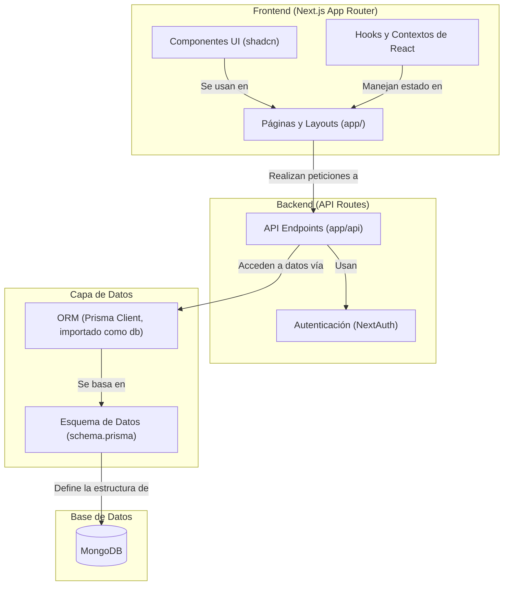

# Diagrama de Componentes

```mermaid
graph TD
    subgraph "Frontend (Next.js App Router)"
        A["Componentes UI (shadcn)"]
        B["Páginas y Layouts (app/)"]
        C["Hooks y Contextos de React"]
    end

    subgraph "Backend (API Routes)"
        D["API Endpoints (app/api)"]
        E["Autenticación (NextAuth)"]
    end

    subgraph "Capa de Datos"
        F["ORM (Prisma Client, importado como db)"]
        G["Esquema de Datos (schema.prisma)"]
    end

    subgraph "Base de Datos"
        H[(MongoDB)]
    end

    A -- "Se usan en" --> B
    C -- "Manejan estado en" --> B
    B -- "Realizan peticiones a" --> D
    D -- "Usan" --> E
    D -- "Acceden a datos vía" --> F
    F -- "Se basa en" --> G
    G -- "Define la estructura de" --> H
```
