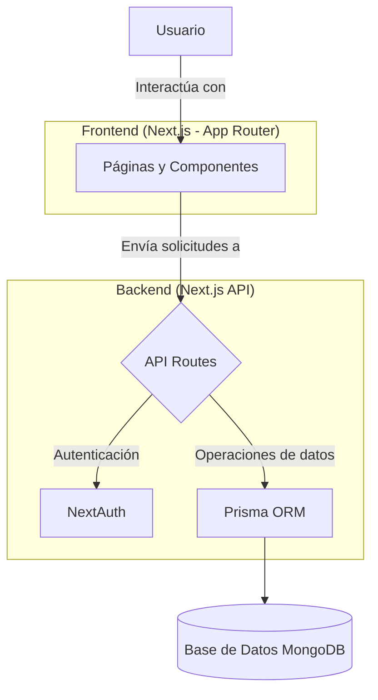

# Diagrama de Contexto

```mermaid
graph TD
    A[Usuario] -->|Interactúa con| B(Interfaz de Usuario)
    B -->|Envía solicitudes a| C{API Routes}
    C -->|Autenticación| D[NextAuth]
    C -->|Operaciones de datos| E[Prisma ORM]
    E --> F[(Base de Datos MongoDB)]

    subgraph "Frontend (Next.js - App Router)"
        B[Páginas y Componentes]
    end

    subgraph "Backend (Next.js API)"
        C
        D
        E
    end
```
